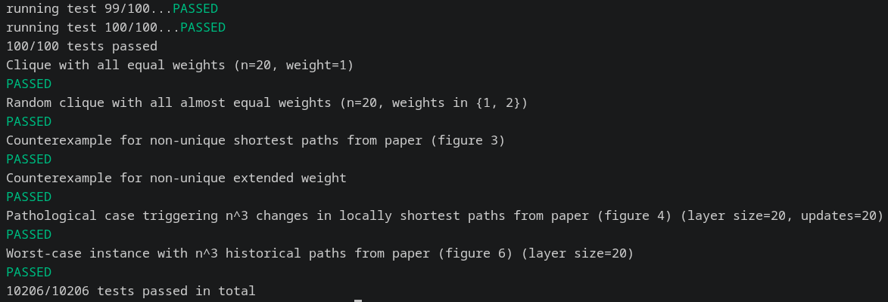
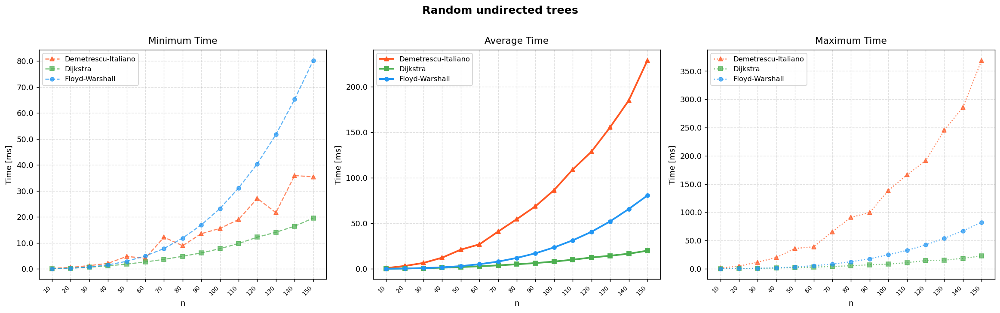
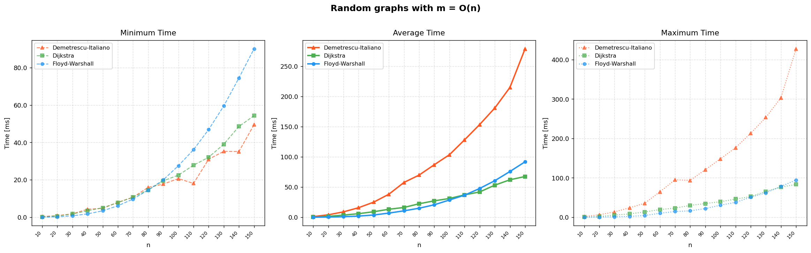
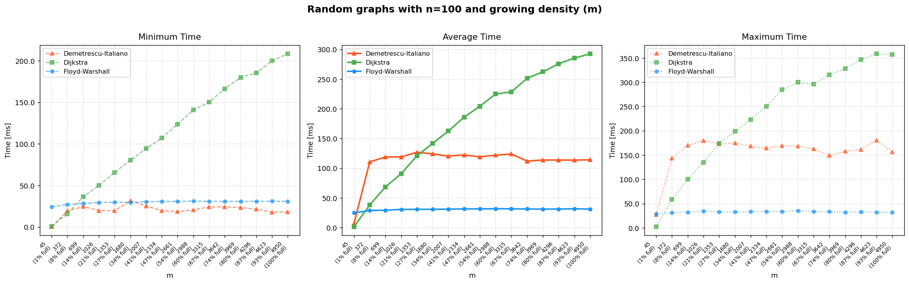
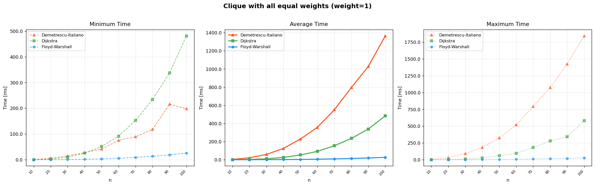
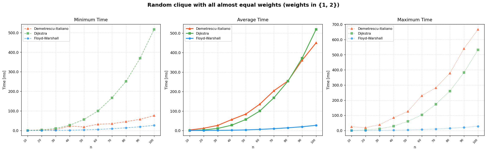
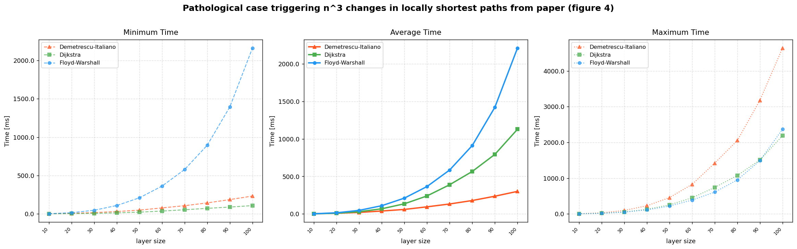
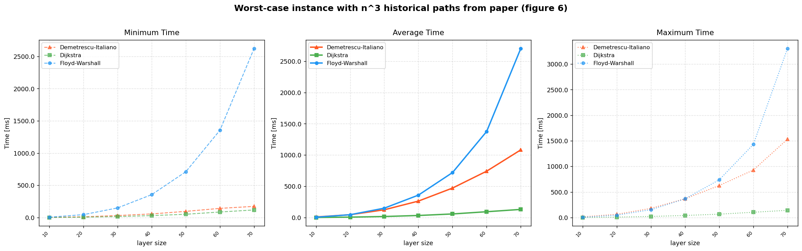

# Fully-Dynamic All-Pairs Shortest Paths

## TODO
- [x] brute
    - [x] Floyd-Warshall (O(n^3))
    - [x] Dijkstra (z `std::priority_queue`)
    - [ ] Dijkstra z Fibonacci Heap (optional)
- [x] praca Italiano,Demetrescu
    - [x] tie breaking
    - [x] wariant fully-dynamic
    - [ ] optymalizacja
- [ ] praca Thorup
    - [ ] podział na poziomy - wersja O(n^2 log^2(n))
        - [ ] debug
    - [ ] optymalizacja dla grafów rzadkich
- [ ] w pracach jest, żeby co jakiś czas restartować strukturę od zera, żeby się amortyzowało
- [ ] test z losowymi wagami typu `double` (żeby były unikalne długości ścieżek)
- [ ] odpalić testy z większym n (>1000 ?) - zobaczyć, czy i kiedy pokonamy brute
- [ ] formatter (clang-format) (optional)

## Correctness Tests

## Performance Benchmarks

Comparison of **Floyd-Warshall**, **Dijkstra**, and **Demetrescu-Italiano** on the dynamic All-Pairs Shortest Paths problem.
Each plot shows **minimum**, **average**, and **maximum** time per update (in ms).

---

### Random Undirected Trees

---

### Random Graphs with m = O(n)

---

### Random Graphs with n=100 and Growing Density (m)

---

### Clique with All Equal Weights (weight=1)

---

### Random Clique with Almost Equal Weights (weights in {1, 2})

---

### Pathological Case - n³ Changes in Locally Shortest Paths (Figure 4)

---

### Worst-Case Instance - n³ Historical Paths (Figure 6)

